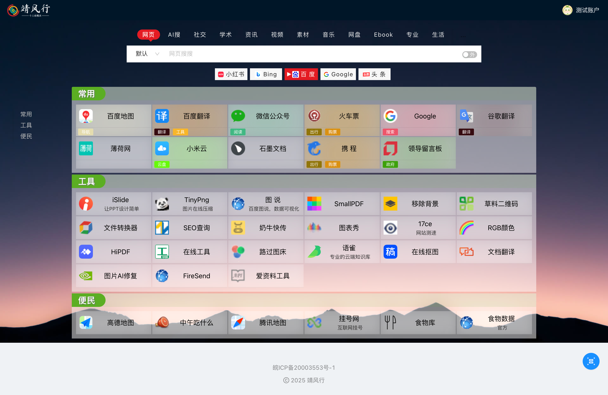

# 关于导航

预览地址：[点这里](https://www.haohome.top/)

- 本人非计算机专业，对代码比较感兴趣，水平有限大牛勿喷，平常花在这上面的时间不多;
- 导航设计初衷是一切从简，最简便的网址添加、分类管理；
- 前后端配置，前端基于react的umi，后端接口采用node的egg.js；

## 页面截图

### 首页


### 二级分类页面



### 编辑模式


### 搜索配置


## 使用

### 1.安装配置

克隆项目：`git clone https://github.com/yifoo/Website_navigation.git`

安装依赖：本项目前后端分离，依赖需要独立安装，请分别进入`client`和`server`文件夹 `pnpm i`

#### 1）前端服务配置：

接口请求前缀：默认地址为`http://localhost:8000/api/`

生产环境配置`client/config/paramConfig.js`的`apiUrl`

其他环境请配置代理文件：`client/config/proxy.js`，开发环境已经配置：

```js
dev: {
    '/api/': {
      // 要代理的地址
      target: 'http://localhost:7000/',
      // 依赖 origin 的功能可能需要这个，比如 cookie
      changeOrigin: true,
    },
  }
```

开发指令：`pnpm dev`

编译指令：`pnpm build`,默认编译文件在`client/dist`文件夹

#### 2）后端服务配置

需要初始化的`sql`文件在根文件夹，导入 `mysql`数据库即可,数据库访问配置在`server/config`中:

> 默认环境配置`config.default.js`；
>
> 开发环境配置`config.dev.js`；
>
> 生产环境配置`config.pro.js`;

开发指令：`pnpm dev`

运行指令：`pnpm start`

### 2.用户使用

#### 1) 注册使用

用户注册默认初始化公共网址数据，然后自定义自己的网址库；

> 测试账户:`test`,密码：`123456`；
>
> 登录`test`账号后即可管理公共账号的网址，也是为了便于管理公共网址而设计;

#### 2) 设置中心

- 账户中心：支持用户登录名、昵称、密码修改

- 角色管理：默认三个角色管理权限，权限通过`umi`的`plugin-access`控制，根目录的`access.js`已经配置号，自动根据`config/route.js`中的`access`代码与后台数据返回的权限码对应；

- 搜索配置：

  - 搜索项支持前端页面配置，鼠标滑动到右上角头像点击“设置中心”，再选择搜索配置即可；

  - 时间有限，没有做搜索选项的拖动排序，直接输入排序编号

  - 支持同一个搜索有不同的高级搜索选项配置，配置生效及时渲染


#### 3）网址部分

- 网址结构: 分类（`sort`）——二级分类（`subSort`)——网址（`sites`）三级去设计的，支持楼层导航功能；
- 导航布局：一开始采用了瀑布流，但添加网址时重新计算高度时体验很不好，这里是参考了一个国外网站布局做的，分两列展示，感觉还不错，有好的建议希望能者提出来；
- 二级分类下钻：点击一级分类标题，可下钻显示二级分类和网址，二级分类页可根据网址标签显示不同高亮背景颜色；
- 编辑模式：网页右下角有个悬浮按钮，鼠标悬浮即可选择编辑模式，编辑模式下网址管理一目了然

  - 编辑模式会显示选择排序导航栏，依次是大类排序、子类排序、网址排序，根据浮窗选项选择相应分类拖动排序即可；
  - 添加分类：可以选择快捷的内置颜色作为背景，也可自定义颜色；
  - 添加网址：粘贴网站地址，若网站图标为空，会自动获取网站的图标；网站可配置标签，在二级分类下钻页面中，这个标签会根据标签生成颜色，让网址背景多彩化；

#### 4）适配

简单适配了PC端和移动端屏幕

#### 5）缓存

这是新加的功能，网址默认缓存在本地`localstorage`减少重复打开网站的请求，而更新/编辑网址会自动更新，只有在不同浏览器打开网站会存在数据不是最新的情况，这时可以点击右下角的小图标选择`刷新一下`即可。

### update 2025-01-20

- 增加设置中心，可以修改登录名、昵称和登录密码；
- 增加用户管理和角色权限管理，默认可以配置三个角色；
- 增加搜索记录功能
（本次改动调整了数据，如遇到问题建议重新导入数据库`nav_test.sql`文件）

### update 2025-01-11

- 优化二级分类路由地址
- 优化二级分类页面显示，增加标签个性化高亮背景显示，增加导航条；

### update 2025-01-09

- 增加点击一级分类下钻展示；
- 优化编辑模式下网址拖拽不流畅及其他bug；

### update 2022-12-29

- 优化网站代码结构；
- 添加点击图标查看网站基础信息，添加网站标签编辑和点击图标实时网站查看

### update 2022-06-04

- 以`antd-pro`为基础替换UI模板；
- 优化代码，新学了`react hooks`的用法大量应用，真的好用；
- 支持搜索项前端配置；
- 分类背景颜色可自定义；

### update 2022-05-08

- 修复图标获取`bug`；
- 修复初始化数据数据错误；
- 登录样式调整，图标更换；

### update 2021-12-29

- 基于`react`版本导航更新(`umijs+dva+egg`)

### update 2021-10-09

- 再次代码重构了导航，努力做最简洁的个人网址导航；
- 本次采用`Umijs+dva+egg`,前后端分离，jwt鉴权token验证；
- 适当的时候将开源。

### update 2020-03-02

> 去掉了Redis (如需恢复请切换 `develop`分支)
