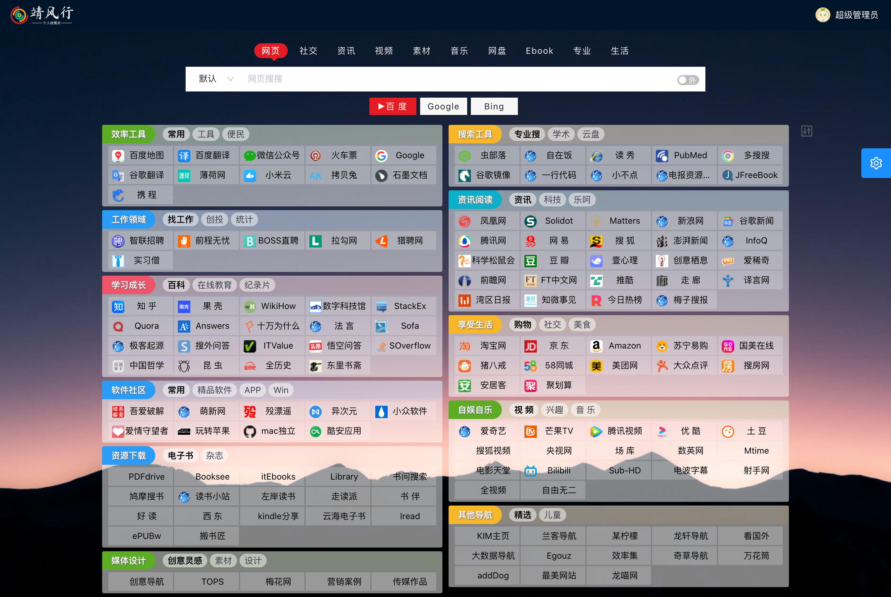
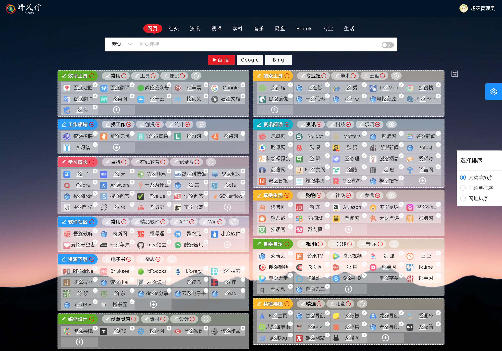
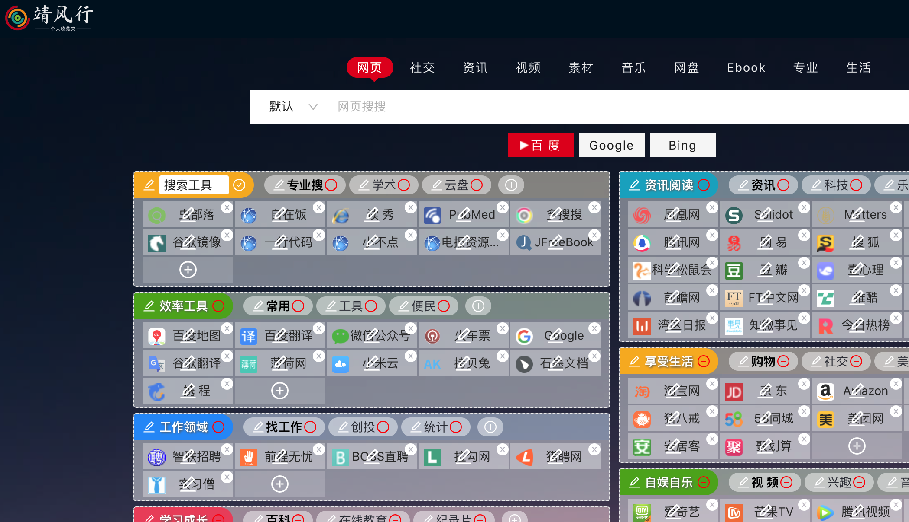
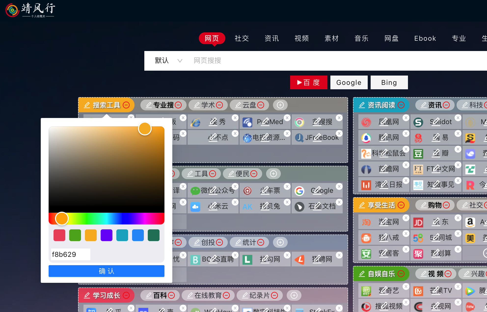
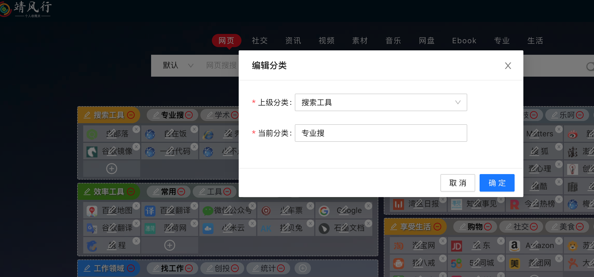
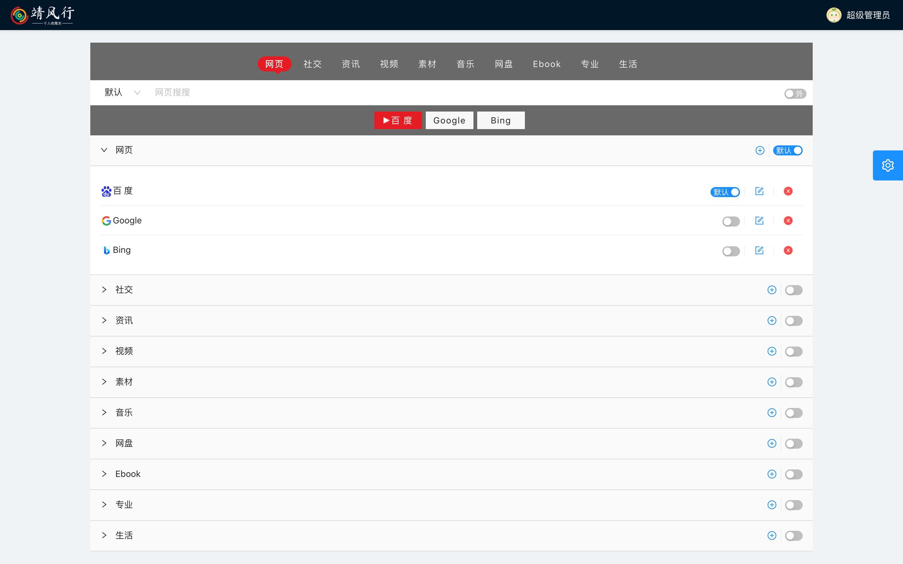
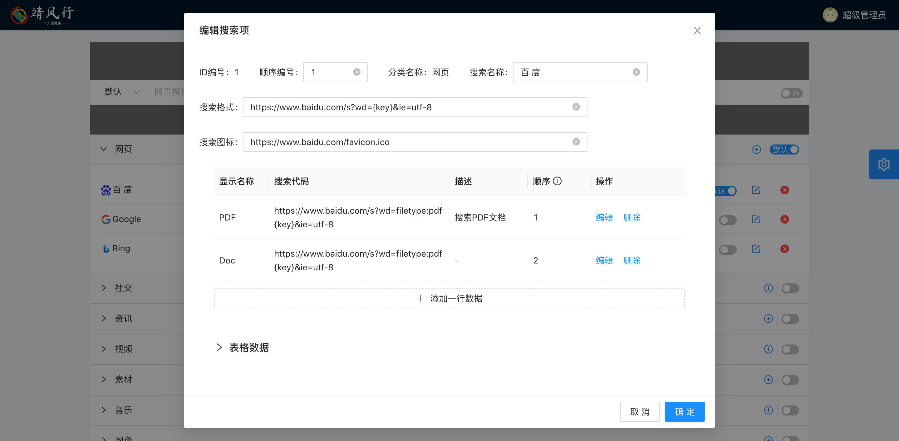

# 关于导航

预览地址：[点这里](https://www.haohome.top/)

- 本人非计算机专业，对代码比较感兴趣，水平有限大牛勿喷，平常花在这上面的时间不多;
- 导航的设计原则是风格简洁，前端基于react，后端接口采用node编写；
- 切换Vue版本,请打开[这里](https://github.com/yifoo/Website_navigation/tags).

## 页面截图

### 首页

### 编辑模式

### 搜索配置

## 使用

1. 安装

   克隆项目：`git clone https://github.com/yifoo/Website_navigation.git`

   安装依赖：进入client和server文件夹 `pnpm i`

   初始化 `sql`文件在跟文件夹，导入 `mysql`数据库即可,数据库访问配置在server/config中
2. 账号：

   超级管理员:admin ,密码：123456；
   普通访客:test,密码：123456；
   登录test账号后即可管理公共账号的网址，也是为了便于管理公共网址而设计;

   超级管理员可配置搜索项。
3. 注册使用：用户注册可选择初始化公共网址数据，然后自定义自己的网址库
4. 搜索引擎

   - 搜索项支持前端页面配置，没有针对用户拆分，只能管理员配置，路径点击右上角头像选择“个人设置”即可。
   - 时间有限，没有做拖动排序，直接输入排序编号
   - 支持同一个搜索有不同的高级搜索选项配置，配置生效及时渲染
5. 网址部分

  网址结构:  分类（sort）——二级分类（subSort)——网址（sites）三级去设计的；

  布局：一开始采用了瀑布流，但添加网址时重新计算高度时体验很不好，这里是参考了一个国外网站布局做的，分两列展示，感觉还不错，有好的建议希望能者提出来；

  编辑模式：

- 设计这个导航的初衷就是希望一切操作从简，最简单添加、分类网址，就有了编辑模式而未采用后台管理的形式。
- 添加分类可以选择内置的背景颜色，也可自定义
- 排序：根据浮窗选项选择相应分类拖动排序即可，网址排序原生拖拽，没空研究使用体验差点；

6. 适配：简单适配了PC端和移动端屏幕，移动模式下拖动排序有bug

### update 2022-12-29

- 优化网站代码结构；
- 添加点击图标查看网站基础信息，添加网站标签编辑和点击图标实时网站查看

### update 2022-06-04

- 以antd-pro为基础替换UI模板；
- 优化代码，新学了react hooks的用法大量应用，真的好用；
- 支持搜索项前端配置；
- 分类背景颜色可自定义；

### update 2022-05-08

- 修复图标获取bug；
- 修复初始化数据数据错误；
- 登录样式调整，图标更换；

### update 2021-12-29

- 基于react版本导航更新(umijs+dva+egg)

### update 2021-10-09

- 再次代码重构了导航，努力做最简洁的个人网址导航；
- 本次采用Umijs+dva+egg,前后端分离，jwt鉴权token验证；
- 适当的时候将开源。

### update 2020-03-02

> 去掉了Redis (如需恢复请切换 `develop`分支)
